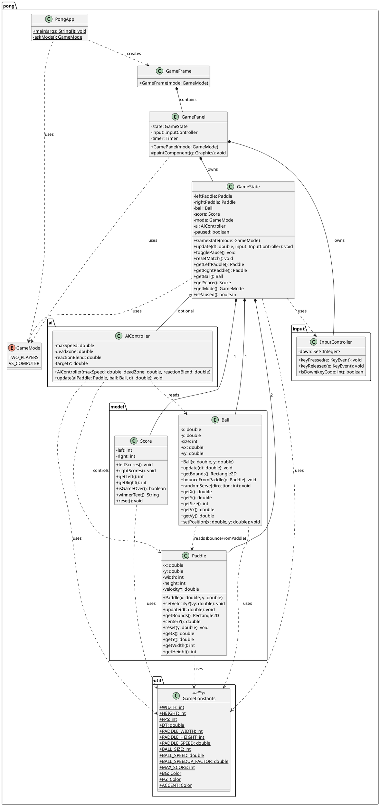

# Pong (Java, OOP) – Dokumentation

## Kurzbeschreibung

Objektorientiertes Pong-Spiel in Java (Swing), aufgeteilt in klar getrennte Schichten:

- **Model** (`pong.model`): Spielobjekte und Logik (Ball, Paddle, Score)
- **Controller** (`pong.input`, `pong.ai`): Tastatureingabe und KI-Steuerung
- **State** (`pong.GameState`): Spielzustand, Update-Schleife, Kollisionen, Punktestand
- **View** (`pong.GamePanel`, `pong.GameFrame`): Rendering und Fenster-Management
- **Util** (`pong.util.GameConstants`): Globale Spielkonstanten

---

## Features

- 2 Modi:
  - `TWO_PLAYERS` (lokal): links `W/S`, rechts `↑/↓`
  - `VS_COMPUTER`: links `W/S`, rechts KI
- Pause: `P`
- Neustart: `R`
- Siegbedingung: erstes Team mit 10 Punkten (konfigurierbar via `GameConstants.MAX_SCORE`)
- Smooth-AI mit einstellbarer Reaktionsverzögerung (`reactionBlend`)

---

## Architekturüberblick

```
PongApp (main)
  └─> GameFrame (JFrame)
        └─> GamePanel (JPanel, Game-Loop via javax.swing.Timer)
              ├─> GameState (Spiellogik, Update-Schleife)
              │     ├─> Paddle (links & rechts)
              │     ├─> Ball
              │     ├─> Score
              │     ├─> InputController (KeyAdapter)
              │     └─> AiController (nur VS_COMPUTER)
              └─> InputController (KeyAdapter, direkt am Panel)
```

---

## UML-Klassendiagramm (PlantUML)

> Kann z.B. mit dem PlantUML-Plugin in IntelliJ IDEA oder VS Code gerendert werden.



---

## Klassenverantwortlichkeiten

| Klasse | Paket | Aufgabe |
|---|---|---|
| `PongApp` | `pong` | Einstiegspunkt, Moduswahl via `JOptionPane` |
| `GameFrame` | `pong` | Swing-Fenster, hält das `GamePanel` |
| `GamePanel` | `pong` | Rendering (Swing), Game-Loop via `javax.swing.Timer` |
| `GameState` | `pong` | Spielzustand, Update-Logik, Kollisionserkennung, Punktestand |
| `GameMode` | `pong` | Enum: `TWO_PLAYERS` / `VS_COMPUTER` |
| `Paddle` | `pong.model` | Schläger-Position, Bewegung, Kollisionsbox |
| `Ball` | `pong.model` | Ball-Position, Bewegung, Wandreflexion, Paddle-Bounce |
| `Score` | `pong.model` | Punktestand, Siegbedingung |
| `InputController` | `pong.input` | Tastatureingaben via `KeyAdapter` |
| `AiController` | `pong.ai` | KI-Steuerung des rechten Schlägers mit Reaktionsverzögerung |
| `GameConstants` | `pong.util` | Zentrale Spielkonstanten (Größen, Geschwindigkeiten, Farben) |
