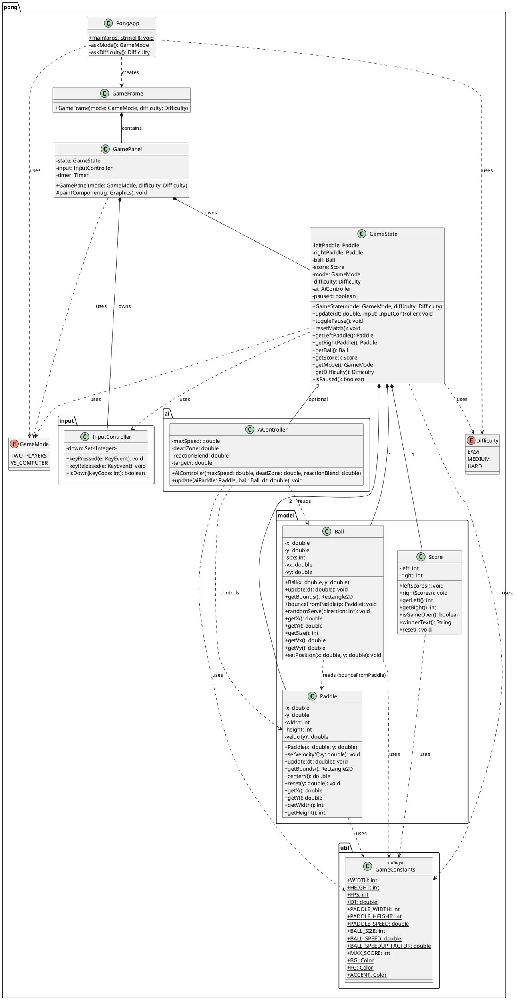

# Pong (Java, OOP) – Documentation

## Brief Description

An object-oriented Pong game in Java (Swing), divided into clearly separated layers:

- **Model** (`pong.model`): Game objects and logic (Ball, Paddle, Score)
- **Controller** (`pong.input`, `pong.ai`): Keyboard input and AI control
- **State** (`pong.GameState`): Game state, update loop, collisions, score
- **View** (`pong.GamePanel`, `pong.GameFrame`): Rendering and window management
- **Util** (`pong.util.GameConstants`): Global game constants

---

## Features

- 2 modes:
  - `TWO_PLAYERS` (local): left `W/S`, right `↑/↓`
  - `VS_COMPUTER`: left `W/S`, right AI
- 3 difficulty levels (only `VS_COMPUTER`): `EASY`, `MEDIUM`, `HARD`
- Pause: `P`
- Restart: `R`
- Win condition: first team with 10 points (configurable via `GameConstants.MAX_SCORE`)
- Smooth AI with difficulty-dependent speed, tolerance zone and reaction delay (`reactionBlend`)

---

## Architecture Overview

```
PongApp (main)
  └─> GameFrame (JFrame)
        └─> GamePanel (JPanel, Game-Loop via javax.swing.Timer)
              ├─> GameState (game logic, update loop)
              │     ├─> Paddle (left & right)
              │     ├─> Ball
              │     ├─> Score
              │     ├─> InputController (KeyAdapter)
              │     └─> AiController (only VS_COMPUTER)
              └─> InputController (KeyAdapter, directly on panel)
```

---

## UML Class Diagram (PlantUML)

> Can be rendered e.g. with the PlantUML plugin in IntelliJ IDEA or VS Code.



---

## Class Responsibilities

| Class | Package | Responsibility |
|---|---|---|
| `PongApp` | `pong` | Entry point, mode selection and difficulty selection via `JOptionPane` |
| `GameFrame` | `pong` | Swing window, holds the `GamePanel` |
| `GamePanel` | `pong` | Rendering (Swing), game loop via `javax.swing.Timer` |
| `GameState` | `pong` | Game state, update logic, collision detection, score |
| `GameMode` | `pong` | Enum: `TWO_PLAYERS` / `VS_COMPUTER` |
| `Difficulty` | `pong` | Enum: `EASY` / `MEDIUM` / `HARD` – controls AI parameters |
| `Paddle` | `pong.model` | Paddle position, movement, collision box |
| `Ball` | `pong.model` | Ball position, movement, wall reflection, paddle bounce |
| `Score` | `pong.model` | Score, win condition |
| `InputController` | `pong.input` | Keyboard input via `KeyAdapter` |
| `AiController` | `pong.ai` | AI control of the right paddle with difficulty-dependent reaction |
| `GameConstants` | `pong.util` | Central game constants (sizes, speeds, colors) |
